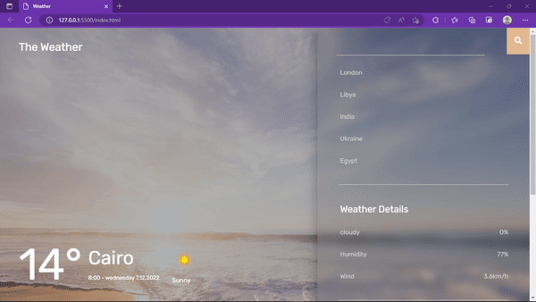

<h1 align="center">Weather App</h1>

###

<h3 align="left">☁ Weather forecasting is the application of science and technology to predict the conditions of the atmosphere for a given location and time.</h3>

###

<h2 align="left">Instructions:</h2>

###

<h3 align="left">1️⃣  git clone <clone url></h3>

###

<h3 align="left">2️⃣  open project on vs code</h3>

###

<h3 align="left">3️⃣ Run it using the live server</h3>

###

<h2 align="left">API:</h2>

###

<h3 align="left">Open Weather Map:</h3>

###

<h4 align="left">https://openweathermap.org/api</h4>

###

<h2 align="left">Demo</h2>

###

###

<h2 align="left">Social media</h2>

###

  

###
